<h1 align="center"> Dynamic Goals-Based Wealth Management </h1>


Update 9 Dec, 2022:
To run:

Directly run GBWM.mlx

OR 

set up first by

1. Specifying the symbols of stocks want to invest in
2. Specifying the period of investment (in years) 
3. Specifying the total expected return 


Original Post:
Portfolio Optimization by Reinforcement Learning and Dynamic Programming with **[MATLAB](https://www.mathworks.com/products/matlab.html)**.


## **To run**:
Reinforcement-learning:
	Open and run **[agent/main_qln.m](https://github.com/powerzbt/GBWM/blob/main/agents/main_rl.m)** 
OR
	**[rl_demo.mlx](https://github.com/powerzbt/GBWM/blob/main/rl_demo.mlx)**.

Dynamic Programming:
	Open and run **[agent/main_dp.m](https://github.com/powerzbt/GBWM/blob/main/agents/main_dp.m)** 
OR
	**[dp_demo.mlx](https://github.com/powerzbt/GBWM/blob/main/dp_demo.mlx)**.


## **Demonstration**:
Open 
	**[rl_demo.pdf](https://github.com/powerzbt/GBWM/blob/main/rl_demo.pdf)** 
OR
	**[dp_demo.pdf](https://github.com/powerzbt/GBWM/blob/main/dp_demo.pdf)**.


## **DEMO - RL**:

```matlab:Code
clear
clc
```
  
### Initial Wealth Fixed
```matlab:Code
total_itr = 100;
[mus_qln, trace] = Qln_suggestion(Q, R, TP_cmf_j, state_wealthspace, qln_prams);
n = Qln_plot(Q, R, TP_cmf_j, actions_mu_sig, state_wealthspace, qln_prams, total_itr);
``` 


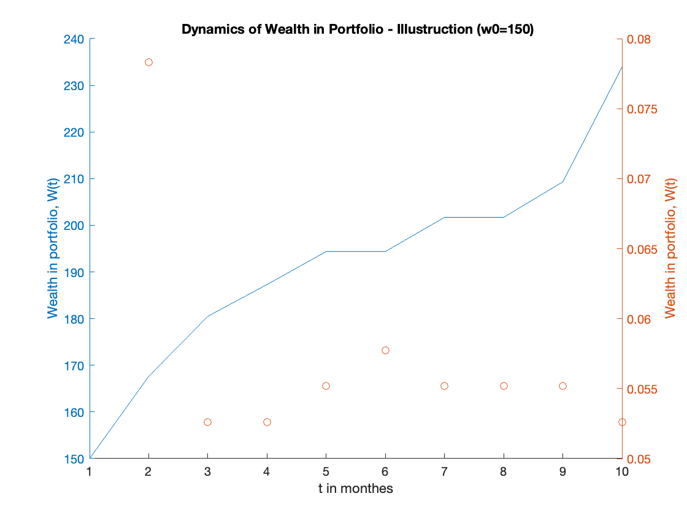
 
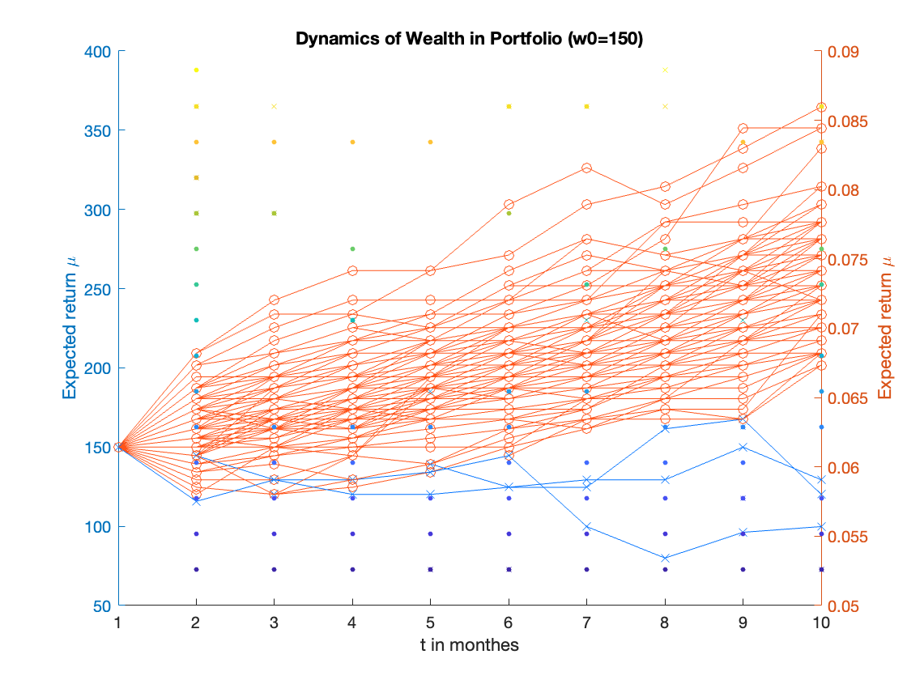

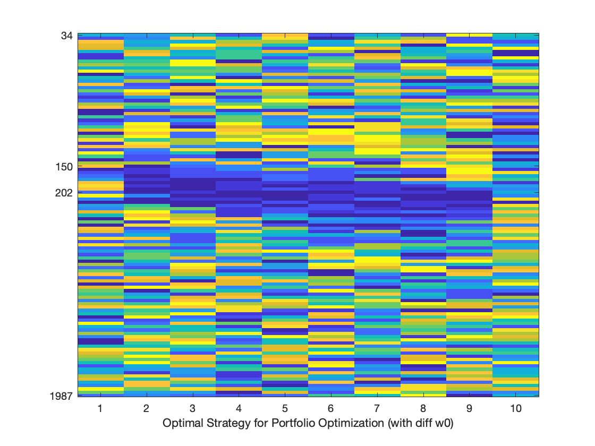
 

### Initial Wealth Varies
```matlab:Code
w0 = 150;
total_itr = 100;
qln_prams = [T, w0, maxItr, alpha, gamma, G];
[mus_qln, trace] = Qln_suggestion(Q, R, TP_cmf_j, state_wealthspace, qln_prams);
n = Qln_plot(Q, R, TP_cmf_j, actions_mu_sig, state_wealthspace, qln_prams, total_itr);
```

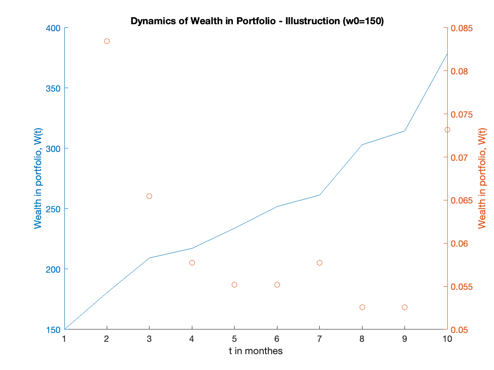
 
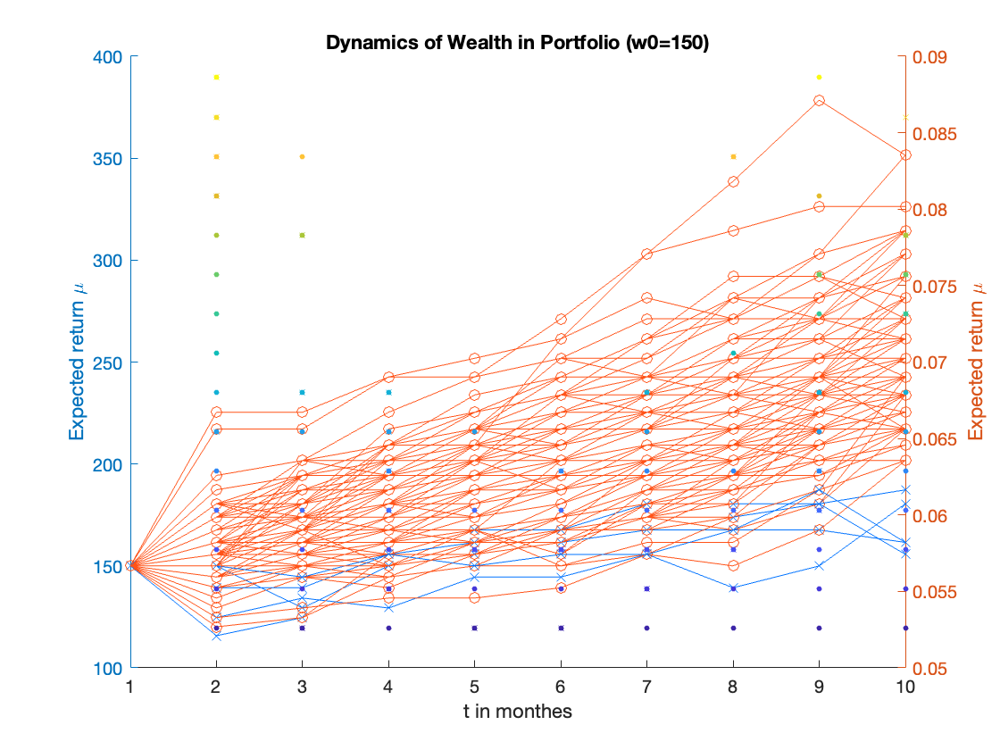

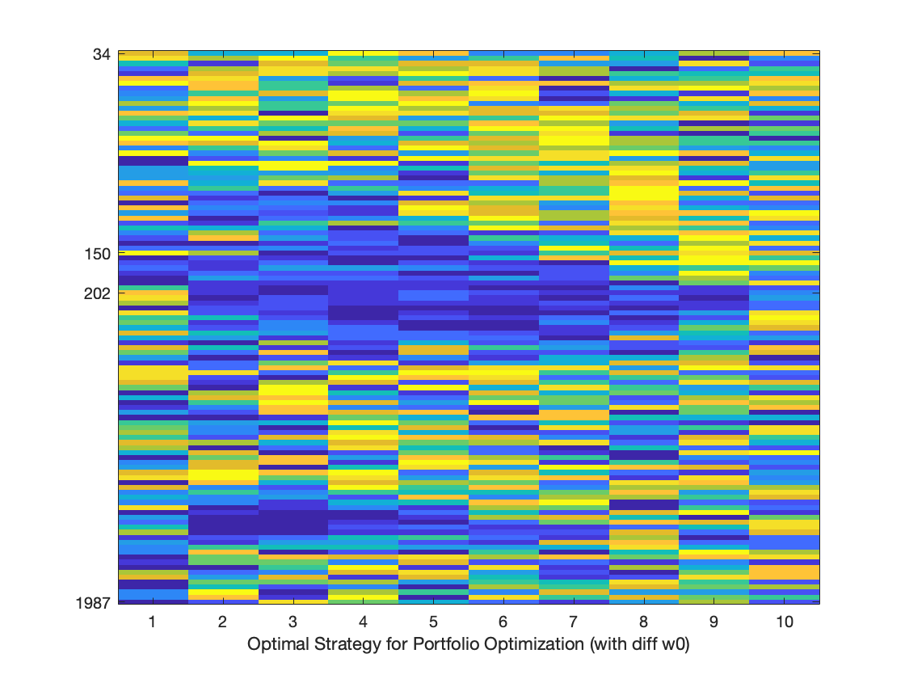 

```matlab:Code

```
 
### Baseline 

```matlab:Code
Q = Init_Q(state_wealthspace, actions_mu_sig, T);
[mus_qln, trace] = Qln_suggestion(Q, R, TP_cmf_j, state_wealthspace, qln_prams);

total_itr = 100;
n = Qln_plot(Q, R, TP_cmf_j, actions_mu_sig, state_wealthspace, qln_prams, total_itr);
```

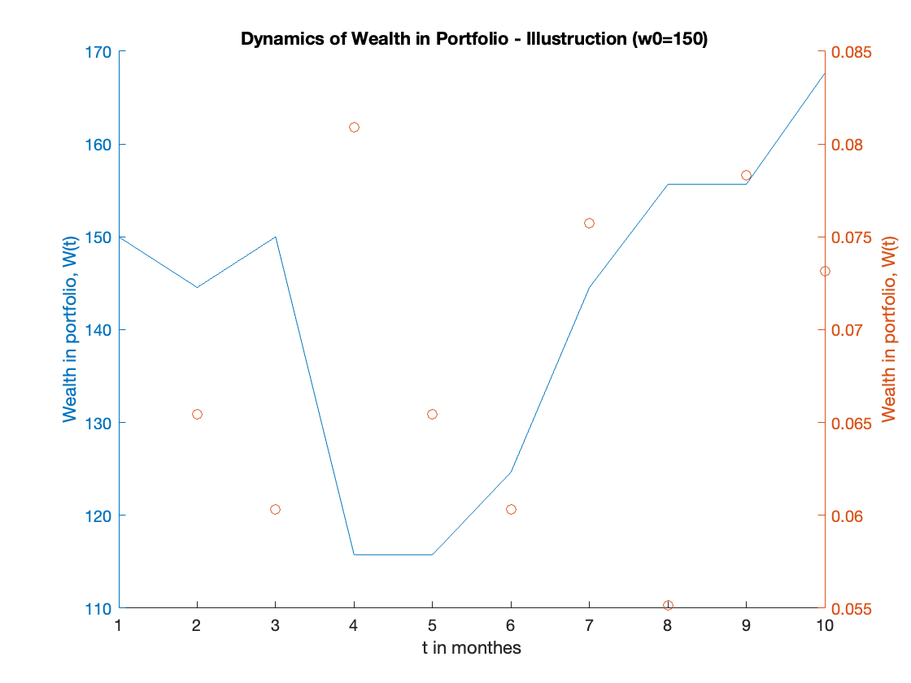
 
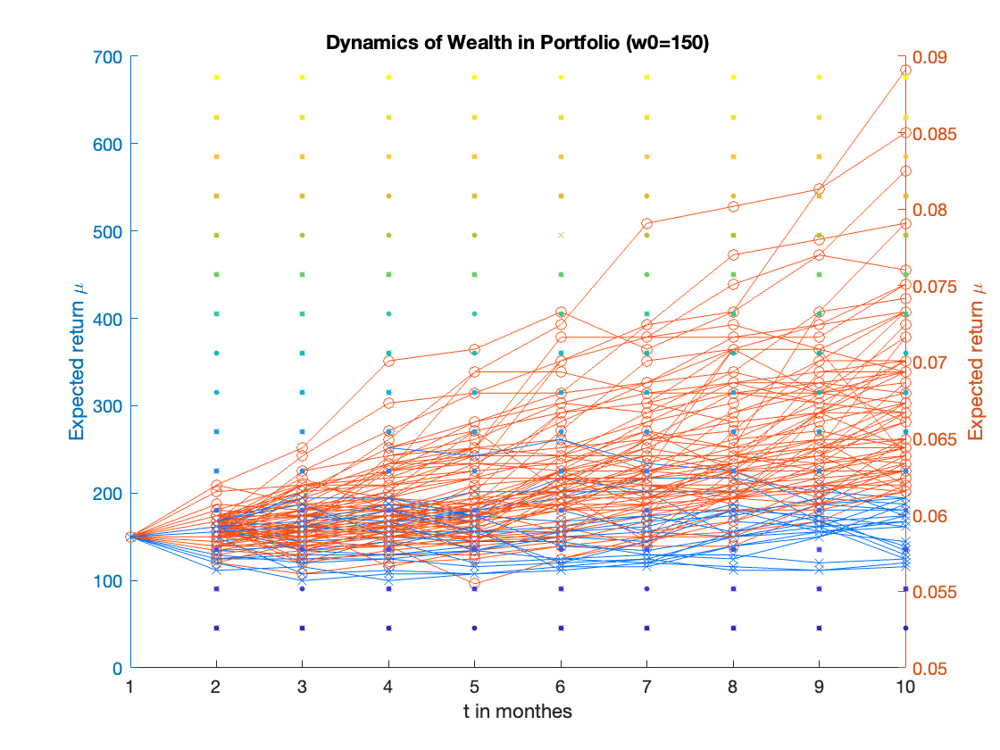

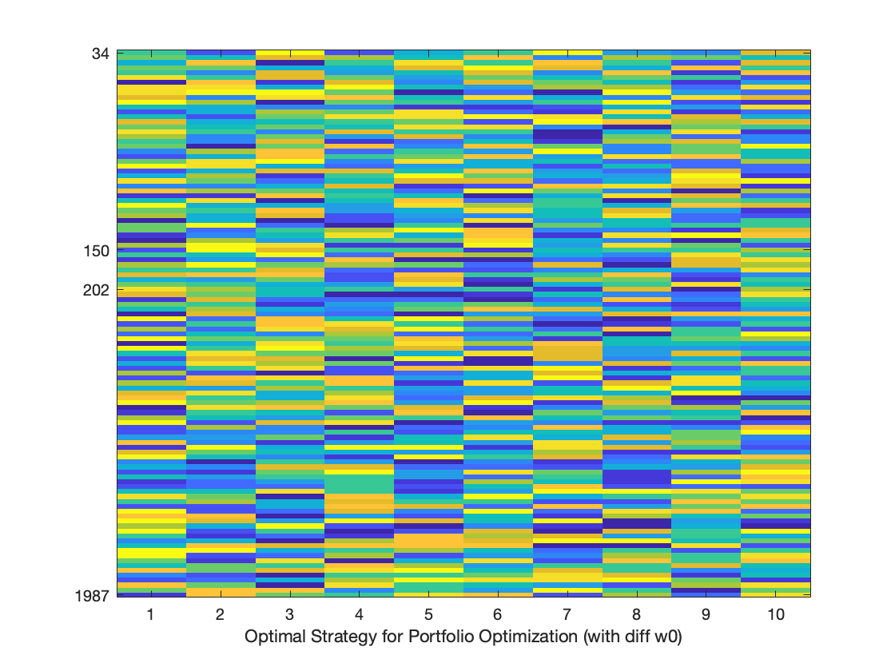  


## **DEMO - DP**:
 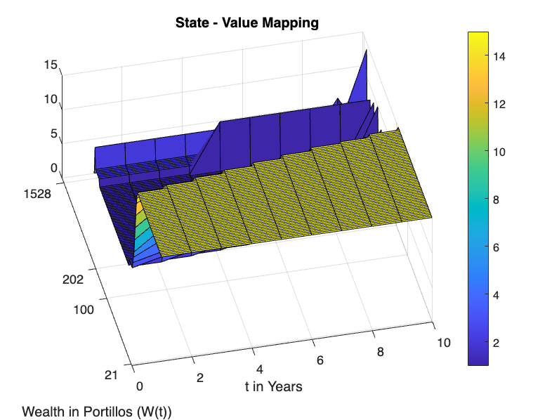

```matlab:Code
traces = dp_plot_2(ef, total_itr, T, w0_idx, G, best_ms, tp_tables, grid);
```
  
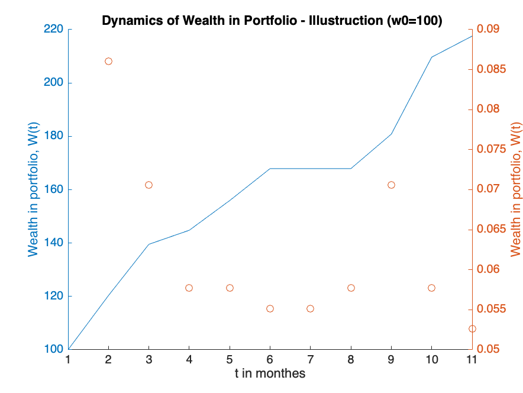

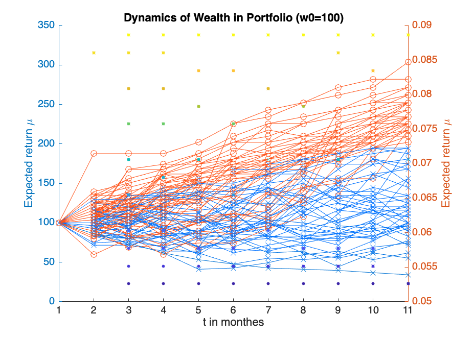 


*Author: Botao Zhang (bz2462@columbia.edu) *
*Bowen Fang (bf2504@columbia.edu) *
*Chongyi Chie (cc4893@columbia.edu) *
*Yichen Yao (yy3204@columbia.edu) *
* *
