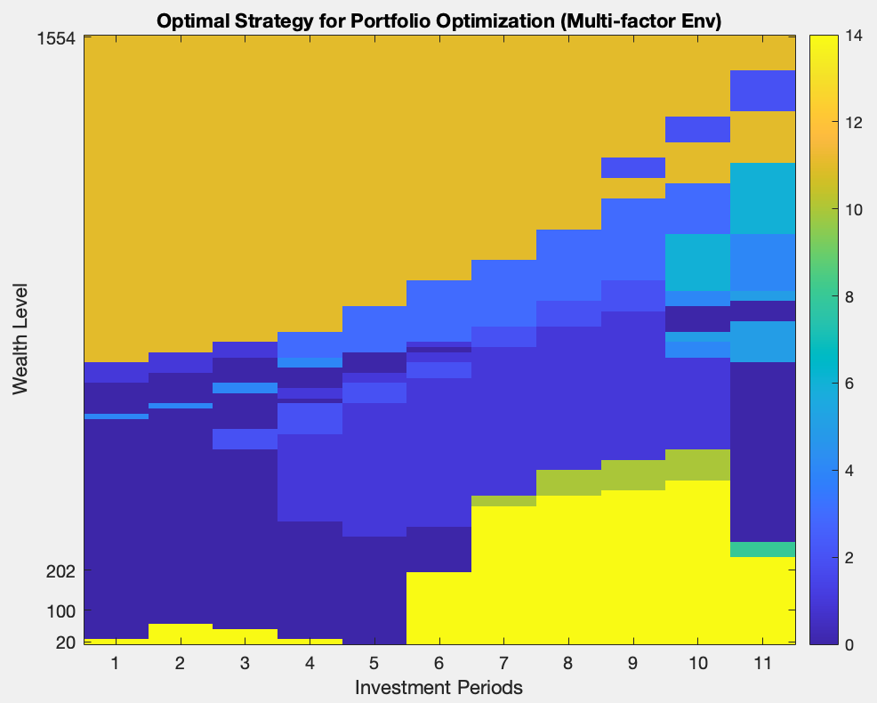
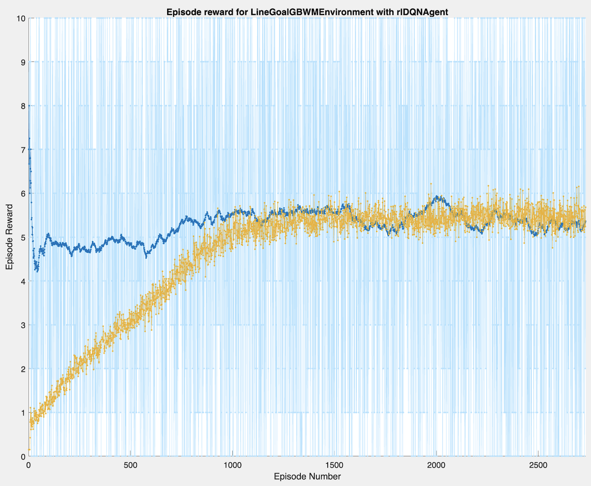
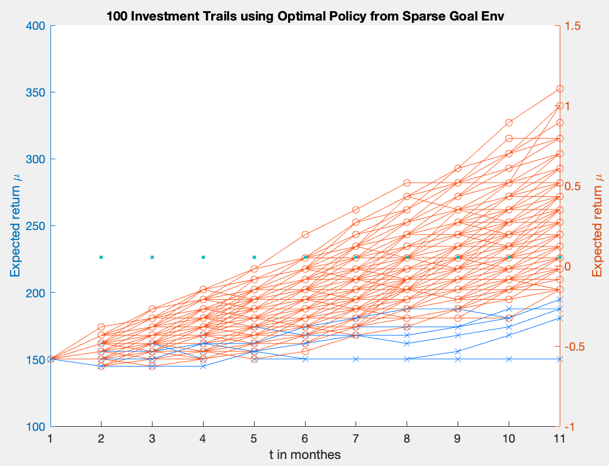
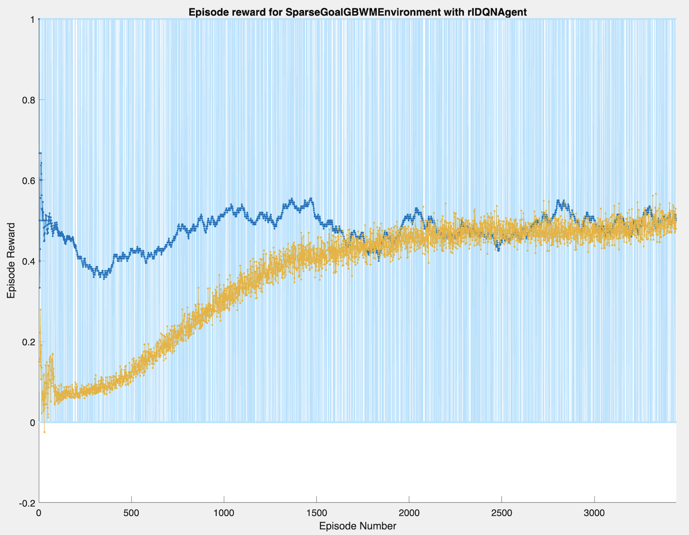

**[MathWorks Blog can be found here](https://blogs.mathworks.com/finance/2023/08/22/reinforcement-learning-as-your-portfolio-advisor)**


<h1 align="center"> Dynamic Goals-Based Wealth Management with Reinforcement Learning </h1>
 
## **Overview**:

This project suggests using reinforcement learning to address portfolio optimization challenges. It is mentored by Mathworks'
**[Valerio Sperandeo](https://wiza.co/d/the-mathworks_2/d598/valerio-sperandeo)** and **[Alejandra Pena-Ordieres](https://www.linkedin.com/in/alejandra-pena-ordieres)**. 

Simply put, the purpose is to optimize the probability of meeting the target after making periodic investments in a particular portfolio by altering weights based on remaining time and wealth in hand.

This is a sequential decision-making problem, at which reinforcement learning excels. In this project, we developed a reinforcement learning system that provides investors with regular investment recommendations based on their investing goals. We researched the  different reward 
While what intestors should perform is straightforward:

If you know the combination of stocks you want to invest in and tell our system what sort of rate of return you want after how many years, our system will be able to swiftly and dynamically give you with the best feasible option in order to reach your goal.


## **To run**:

Set up and run **[GBWM-RLToolbox/main.mlx](https://github.com/powerzbt/GBWM/blob/main/GBWM-RLToolbox/main.mlx)** by

1. Specifying the symbols of stocks want to invest in
2. Specifying the period of investment (in years) 
3. Specifying the total expected return 

## **Presentation**:

[Goal-Based Wealth Management with Reinforcement Learning](https://github.com/powerzbt/GBWM/blob/main/Goal-Based-Wealth-Management-with-Reinforcement-Learning.pdf) 


## **Demo**:

```matlab:Code 
initDate = '2017-01-01';
endDate = '2018-01-01';
initDate = datetime(initDate, 'InputFormat','yyyy-MM-dd');
endDate = datetime(endDate, 'InputFormat','yyyy-MM-dd');
portfolio = ["URTH"; "HYG";"LQD";"DBC"];
c = containers.Map;
for k=1:length(portfolio)
   symbol = portfolio(k);
   data = Yahooscraper(convertStringsToChars(symbol), initDate, endDate, '1d');
   TT = table2timetable(data(:,[1,4]));
   TT.Properties.VariableNames = {convertStringsToChars(symbol)};
   c(symbol) = TT;
end
f = @(i) c(portfolio(i));
T = synchronize(f(1),f(2),f(3), f(4), 'Intersection');
prices = [T.URTH, T.HYG, T.LQD, T.DBC];
ts = timeseries(prices, datestr(T.Date));
ts.Name = " Portfolio Prices over Time";
plot(ts);
legend({'URTH'; 'HYG';'LQD';'DBC'});
...

```
  
### Training with Multi-Factor Environment
```matlab:Code
env =  MultiFactorGBWMEnvironment(G, T, grid, cash, w0_idx, pwgt, pret, prsk, line, simulate_n_periods, simulate_dt, simulate_n_trials);

``` 


Optimal Policy (Indicated by color, the colder the riskier):



100 Investment Trials with Optimal Policy: (Red Lines: successful investments)


Training Episodes:




### Training with Line Reward Environment
```matlab:Code
env =  LineGoalGBWMEnvironment(G, T, grid, cash, w0_idx, pwgt, pret, prsk, line, simulate_n_periods, simulate_dt, simulate_n_trials);

``` 

 <p float="left">
  
   
  
</p>
  
### Training with Scale Goal Environment
```matlab:Code
env =  ScaleGBWMEnvironment(G, T, grid, cash, w0_idx, pwgt, pret, prsk, gamma, simulate_n_periods, simulate_dt, simulate_n_trials);

``` 

 <p float="left">
  
   
  
</p>
  
  
 ### Training with Sparse Goal Environment
```matlab:Code
env =  SparseGoalGBWMEnvironment(G, T, grid, cash, w0_idx, pwgt, pret, prsk, simulate_n_periods, simulate_dt, simulate_n_trials);

``` 

 <p float="left">
  
   
  
</p>
  
  
   

-------------------------------------------------------

<h2 align="left"> Previous Methods </h2>


Portfolio Optimization by Reinforcement Learning (Q-learning) and Dynamic Programming with **[MATLAB](https://www.mathworks.com/products/matlab.html)**.

 

## **To run**:
Reinforcement-learning:
	Open and run **[agent/main_qln.m](https://github.com/powerzbt/GBWM/blob/main/GBWM-PreviousMethods/agents/main_qln.m)** 
OR
	**[rl_demo.mlx](https://github.com/powerzbt/GBWM/blob/main/GBWM-PreviousMethods/rl_demo.mlx)**.

Dynamic Programming:
	Open and run **[agent/main_dp.m](https://github.com/powerzbt/GBWM/blob/main/GBWM-PreviousMethods/agents/main_dp.m)** 
OR
	**[dp_demo.mlx](https://github.com/powerzbt/GBWM/blob/main/GBWM-PreviousMethods/dp_demo.mlx)**.

 

## **Demonstration**:
Open 
	**[rl_demo.pdf](https://github.com/powerzbt/GBWM/blob/main/GBWM-PreviousMethods/rl_demo.pdf)** 
OR
	**[dp_demo.pdf](https://github.com/powerzbt/GBWM/blob/main/GBWM-PreviousMethods/dp_demo.pdf)**.

```matlab:Code

```

## **DEMO - RL**:


  
### Training with Fixed Initial Wealth 


Sample Investment Sequence (2-D State Space: investment period & wealth in hand):


Optimal Q-learning Policy (Indicated by color, the colder the riskier):


100 Investment Trials with Optimal Policy: (Red Lines: successful investments)


```matlab:Code

```
 

### Training with different Initial Wealth (Explore the state space more sufficiently)


 <p float="left">
  
    
</p>


Higher hitting rate achieved!


```matlab:Code

```
 


## **DEMO - DP**: 


 <p float="left">
  
    
</p>


```matlab:Code

```

### Baseline Policy


   

## **Author**:
* Botao Zhang (bz2462@columbia.edu) * Bowen Fang (bf2504@columbia.edu) * Chongyi Chie (cc4893@columbia.edu) * Yichen Yao (yy3204@columbia.edu)

